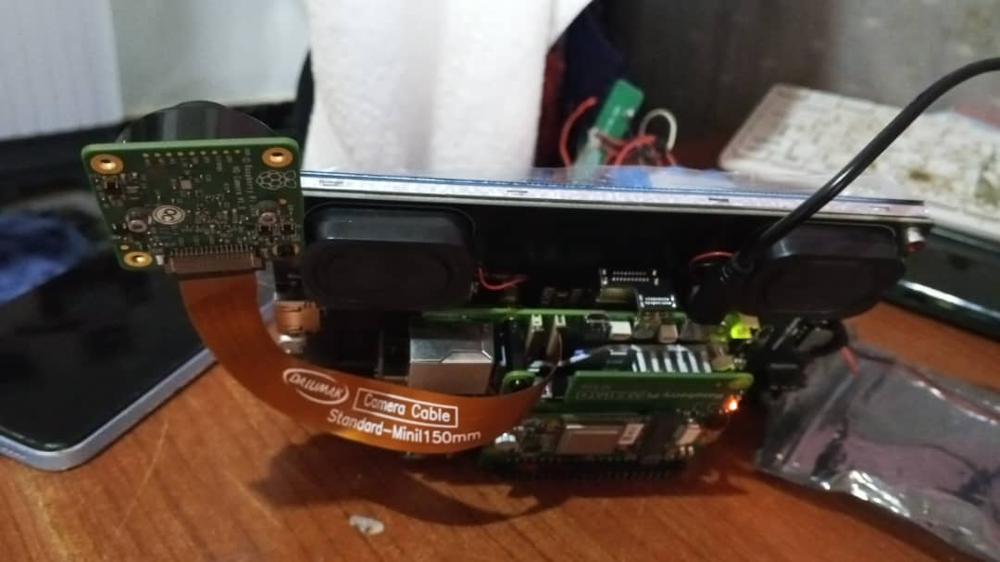
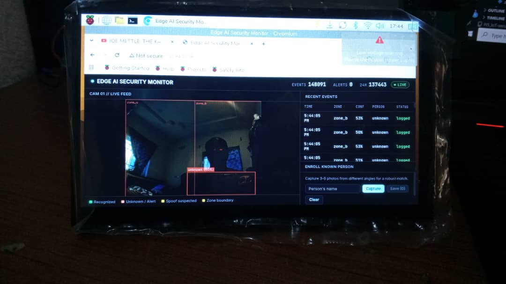

# Edge AI Security Monitor

Real-time, fully offline person detection and re-identification system powered by the Hailo-8L NPU on a Raspberry Pi 5. No cloud, no subscription, no internet dependency for inference — every frame is processed on-device.

[](https://github.com/Olawalekaybee/Pi5_IoT_security_camera/actions)
[](LICENSE)
[](https://www.raspberrypi.com)
[](tests/)

---

## Overview

This project turns a Raspberry Pi 5 and a Hailo-8L AI HAT+ into a self-contained security appliance. A dual-model pipeline runs on the NPU: YOLOv8 for person detection and an OSNet re-identification model for recognizing specific individuals across frames and zones. When someone enters a restricted zone and isn't recognized as a known person — or is recognized but a motion-based liveness check flags the match as suspiciously static — the system fires a Telegram alert, logs the event to a local database, and updates a live web dashboard with an annotated video feed, all without sending a single frame off the device.

It was built to demonstrate real embedded AI engineering against real hardware constraints: a single physical NPU shared between two models, a CPU that has to keep up with detection, re-identification, and video encoding all at once, and the debugging that real deployments actually require — not a notebook demo.

## In action

| Hardware setup | Live dashboard |
|---|---|
|  |  |

The dashboard screenshot above is from a live session: real-time detection boxes on the video feed, the recent-events table updating via Server-Sent Events, and the in-browser enrollment panel — all running on the hardware pictured.

## Why this exists

Most computer vision portfolio projects run on a laptop GPU or a cloud API and stop at "it detects objects." This project goes further in a few specific ways:

- **Real edge hardware, real constraints.** Inference runs on a 26 TOPS NPU drawing under 5W. Getting two models to share one physical Hailo device required HailoRT's Round Robin scheduler — a real driver-level problem, not a config tweak.
- **Two models, one pipeline, throttled deliberately.** Detection and re-identification both run on-device. Re-ID is throttled per tracked person (rather than re-run on every camera frame) after profiling showed naive per-frame inference was the direct cause of visible video stutter under load.
- **A motion-based liveness heuristic.** Recognizing a face isn't the same as confirming a live person — holding up a photo of an enrolled person fools plain Re-ID matching. A lightweight heuristic tracks per-person bounding-box motion and flags matches that look suspiciously static, with the limitations of that approach documented honestly in the code rather than oversold.
- **An in-dashboard enrollment workflow.** Enroll a new known person directly from the live feed — capture several photos from the dashboard, and their embeddings are averaged for a more robust reference than a single photo.
- **Shipped like production software.** Docker, systemd, CI, and 44 hardware-free unit tests — not just a `main.py`.

## Features

| Capability | Detail |
|---|---|
| Person detection | YOLOv8 compiled to Hailo's HEF format, running on-NPU |
| Re-identification | OSNet embedding (512-dim) + cosine similarity matching against an enrolled gallery |
| Re-ID throttling | Per-tracked-person inference caching so identity is reverified a few times a second, not on every frame |
| Liveness heuristic | Motion-based check that flags a recognized match as a possible photo/screen spoof if its bounding box stays suspiciously static |
| Zone awareness | Polygon-based restricted-zone definitions; alerts only fire inside configured zones |
| Alerting | Telegram bot integration, per-zone cooldown, alert dispatch on a background thread so a slow network call never blocks the camera pipeline |
| Live dashboard | Single-viewport web UI: annotated MJPEG video feed, live event table via Server-Sent Events, in-browser enrollment |
| Event logging | SQLite in WAL mode with indexed stats queries, safe for concurrent reads while the inference loop writes |
| Hardware-free test mode | CPU mock fallback for both the detection and Re-ID engines, so the full pipeline logic runs without a Hailo HAT |
| Deployment | Docker, systemd service for auto-start on boot, GitHub Actions CI |
| Tests | 44 unit tests, fully hardware-independent |

## Architecture

```
┌─────────────┐     ┌────────────────────┐     ┌───────────────────┐
│   Camera    │────▶│  Hailo-8L NPU      │────▶│  Re-ID Throttle +  │
│ (picamera2/ │     │  YOLOv8 + OSNet    │     │  Liveness Check    │
│  USB/mock)  │     │ (Round Robin sched)│     │                    │
└─────────────┘     └────────────────────┘     └─────────┬──────────┘
                                                           │
                       ┌───────────────────────────────────┼───────────────────────────────────┐
                       ▼                                   ▼                                   ▼
               ┌───────────────┐                 ┌───────────────────┐               ┌───────────────────┐
               │ SQLite (WAL)  │                 │  Telegram Alert    │               │  Flask Dashboard   │
               │  Event Log    │                 │ (cooldown + async  │               │ (SSE table + MJPEG │
               │               │                 │   dispatch)        │               │  feed + enrollment)│
               └───────────────┘                 └───────────────────┘               └───────────────────┘
```

**Inference flow:** camera frame → HailoRT VDevice (shared, Round Robin–scheduled) → YOLOv8 person detection → crop detected persons → throttled OSNet Re-ID embedding → cosine similarity match against the enrolled gallery → liveness check on the matched identity → zone-polygon check → event dispatch (log / alert / dashboard push).

## Hardware

| Component | Spec |
|---|---|
| Raspberry Pi 5 | 8GB RAM |
| Hailo HAT+ | Hailo-8L, 26 TOPS |
| Camera | Pi Camera Module (IMX477), or any USB/CSI camera |
| Storage | microSD card |
| Power | Official Pi 5 USB-C supply |

No Hailo hardware? Both `HailoInferenceEngine` and the Re-ID engine transparently fall back to a CPU mock mode that produces synthetic detections, so the full pipeline — zones, throttling, liveness, alerting, dashboard — can be exercised and tested without owning a HAT.

## Quick start

### 1. Clone and install

```bash
git clone https://github.com/Olawalekaybee/Pi5_IoT_security_camera.git
cd Pi5_IoT_security_camera
python3 -m venv venv --system-site-packages
source venv/bin/activate
pip install -r requirements.txt
```

`--system-site-packages` matters on the Pi: it lets the venv see the system-installed `hailo_platform` package, which isn't distributed on PyPI.

### 2. Configure

Edit `config/settings.yaml` with your model paths, Telegram credentials, and zone polygons — see [Configuration](#configuration) below.

### 3. Run

```bash
python3 main.py --config config/settings.yaml
```

Add `--no-alerts` to disable Telegram while testing, or `--no-dashboard` to skip the web UI. Add `--benchmark` to run a 30-second FPS/latency benchmark instead of the full pipeline.

The dashboard is available at `http://<device-ip>:5000`.

### 4. Run with Docker

```bash
docker compose up -d
```

## Configuration

All runtime settings live in `config/settings.yaml`:

```yaml
models:
  detection_hef: models/yolov8n.hef
  reid_hef: models/osnet_x1_0.hef

telegram:
  bot_token: "YOUR_BOT_TOKEN_HERE"
  chat_id: "YOUR_CHAT_ID_HERE"
  cooldown_seconds: 30

reid:
  similarity_threshold: 0.75   # below this, a match is treated as unknown
  alert_threshold: 0.60

zones:
  restricted:
    - zone_a
  polygons:
    zone_a: [[0, 0], [320, 0], [320, 480], [0, 480]]

dashboard:
  port: 5000
  video_feed_fps: 12   # MJPEG stream rate — kept modest to limit CPU/bandwidth
```

`.hef` model files are not tracked in git (large, platform-specific binaries) — download them directly onto the Pi from the [Hailo Model Zoo](https://github.com/hailo-ai/hailo_model_zoo) into `models/`.

## Enrolling known people

Known people can be enrolled two ways:

1. **From the dashboard** (recommended): open the web UI, enter a name, and click **Capture** 3-5 times from different angles/distances while standing in frame, then **Save**. Multiple captures are averaged into a single, more robust embedding than any one photo alone.
2. **Programmatically**: call `PersonIdentifier.enroll(name, crop, average_with_existing=True)` directly — see `src/reid/identifier.py`.

## Model conversion (ONNX → HEF)

Hailo's Dataflow Compiler converts ONNX models to the Hailo Executable Format (HEF) required by the NPU:

```bash
python3 scripts/convert_to_hef.py \
  --onnx models/yolov8n.onnx \
  --output models/yolov8n.hef \
  --calib-data data/calibration_images/ \
  --hw-arch hailo8l
```

This step needs the Hailo Dataflow Compiler (a separate SDK from `hailo_platform`), typically run on a dev machine rather than the Pi itself.

## Benchmarks

Measured on Raspberry Pi 5 + Hailo-8L HAT, 640×480 input from a Pi Camera Module (IMX477), real live camera feed (not synthetic frames):

| Metric | Value |
|---|---|
| Detection inference latency | ~12 ms average |
| Detection throughput | ~75 FPS |
| Re-ID embedding | 512-dim, cosine similarity matched against the enrolled gallery |
| Re-ID call rate (throttled) | ~2.5 calls/sec per tracked person, not per frame |

These numbers reflect the raw detection loop (`--benchmark` mode). End-to-end throughput with Re-ID, liveness tracking, alerting, and dashboard streaming all active will be somewhat lower, since those compete for the same CPU core as JPEG encoding for the live video feed.

## Project structure

```
Pi5_IoT_security_camera/
├── main.py                      # Entry point
├── src/
│   ├── detection/
│   │   ├── hailo_engine.py      # HailoRT VDevice wrapper, shared-device scheduling, CPU mock fallback
│   │   └── pipeline.py          # Camera capture, detection loop, video feed annotation/encoding
│   ├── reid/
│   │   └── identifier.py        # OSNet embedding, gallery matching, multi-photo enrollment
│   ├── alerts/
│   │   └── telegram_bot.py      # Telegram alerts, per-zone cooldown, async dispatch
│   ├── dashboard/
│   │   └── server.py            # Flask app: SSE event stream, MJPEG video feed, enrollment API
│   └── utils/
│       ├── database.py          # SQLite (WAL) event store
│       ├── zones.py             # Polygon-based zone resolution
│       ├── liveness.py          # Motion-based spoof/liveness heuristic
│       ├── reid_throttle.py     # Per-person Re-ID call throttling
│       └── logger.py
├── scripts/
│   └── convert_to_hef.py        # ONNX → HEF model conversion
├── config/
│   ├── settings.py              # Typed config loader
│   └── settings.yaml            # Runtime config
├── tests/                       # 44 hardware-free unit tests
├── docker/
│   └── edge-ai-monitor.service  # systemd unit for auto-start on boot
├── .github/workflows/ci.yml     # CI pipeline
├── Dockerfile
├── docker-compose.yml
└── requirements.txt
```

## Testing

```bash
pytest tests/ -v
```

All 44 tests run without Hailo hardware, using mocked inference outputs. CI runs the full suite on every push.

## Known limitations

Worth being upfront about, since overclaiming undermines a project meant to demonstrate real engineering judgment:

- **The liveness heuristic is not anti-spoofing.** It catches the common case of holding up a static photo or phone screen, because real liveness detection (Face ID–style depth/IR sensing) needs hardware this project doesn't have. It will not reliably catch a photo mounted on a steady tripod or a sophisticated replay attack, and its motion threshold is tuned against observed false positives rather than a rigorous study — expect it to need further calibration.
- **Re-ID accuracy depends on enrollment quality.** A single low-quality enrollment photo (poor lighting, unusual angle) measurably hurts match confidence; the in-dashboard multi-photo enrollment exists specifically to mitigate this.
- **The Flask development server is used as-is.** It's adequate for this project's scale (one camera, a handful of dashboard viewers) but isn't a production-grade WSGI server; a heavier deployment would warrant Gunicorn with gevent workers for the concurrent MJPEG/SSE streaming load.

## Roadmap

- [ ] Multi-camera support with cross-camera Re-ID
- [ ] Web-based zone editor (draw polygons in-browser instead of YAML)
- [ ] Texture/reflection-based spoof detection as a complement to the motion heuristic
- [ ] Migrate the dashboard to a production WSGI server (Gunicorn + gevent) for heavier concurrent load

## License

MIT — see [LICENSE](LICENSE).

## Acknowledgments

Built on [HailoRT](https://github.com/hailo-ai/hailort), [Ultralytics YOLOv8](https://github.com/ultralytics/ultralytics), [OSNet](https://github.com/KaiyangZhou/deep-person-reid), and the [Hailo Model Zoo](https://github.com/hailo-ai/hailo_model_zoo).